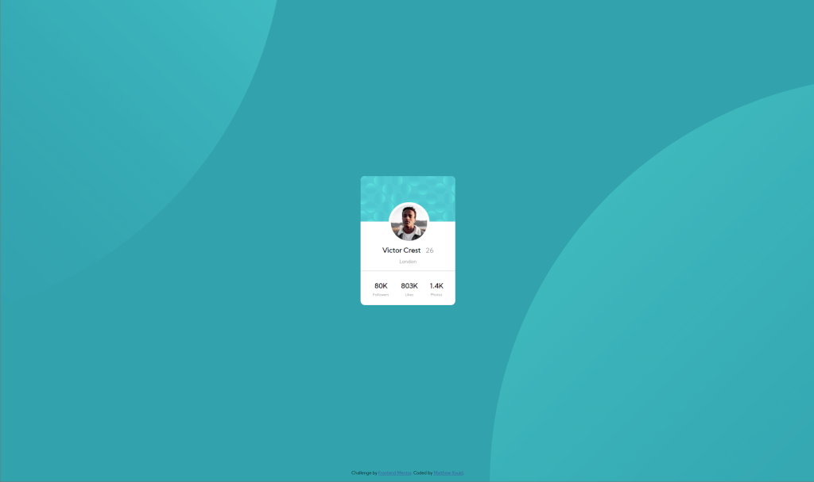
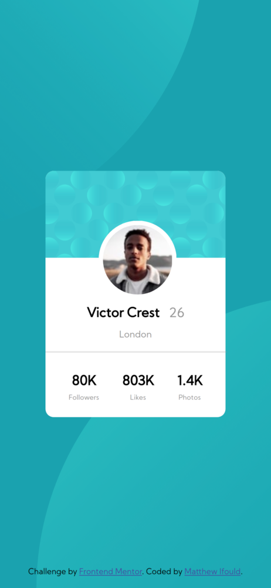

# Frontend Mentor - Profile card component solution

This is a solution to the [Profile card component challenge on Frontend Mentor](https://www.frontendmentor.io/challenges/profile-card-component-cfArpWshJ). Frontend Mentor challenges help you improve your coding skills by building realistic projects. 

## Table of contents

- [Frontend Mentor - Profile card component solution](#frontend-mentor---profile-card-component-solution)
  - [Table of contents](#table-of-contents)
  - [Overview](#overview)
    - [The challenge](#the-challenge)
    - [Screenshot](#screenshot)
      - [Desktop](#desktop)
      - [Mobile](#mobile)
    - [Links](#links)
  - [My process](#my-process)
    - [Built with](#built-with)
    - [What I learned](#what-i-learned)
    - [Continued development](#continued-development)
  - [Author](#author)

## Overview

Create a user profile card as per the images within the design directory. The card should be be responsive and display appropriately in a range of view ports and browsers.

No additional functionality required.

### The challenge

- Build out the project to the designs provided

### Screenshot
#### Desktop

#### Mobile

### Links

- Live Site URL: http://github.obidex.com/profile-card/

## My process

- Apply semantic tags to HTML content
- Add CSS classes to each uniquely styled section
- Apply typography styles
- Apply Image & background styles
- Apply spacing (flexbox, padding, margin etc)
- Add media query for viewport breakpoints
- Tweek values until satisfied

### Built with

- Semantic HTML5 markup
- CSS custom properties
- Flexbox
- Mobile-first workflow

### What I learned

I wanted to learn some of the styling techniques outside of a CSS framework which I usually use. I improved my knowledge of many CSS layout features and used some improved my understanding of the various measurement options available.

### Continued development

Although the design can still be improved in functionality and scope I am happy with the design and I am keen to move onto one of the more challenging projects.

## Author

- Website - [Matthew Ifould](https://obidex.com)
- Frontend Mentor - [@ifouldm](https://www.frontendmentor.io/profile/ifouldm)
- Github - [ifouldm](https://github.com/Ifouldm)

